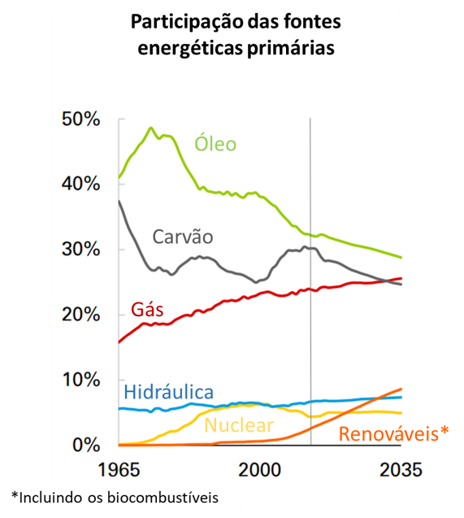
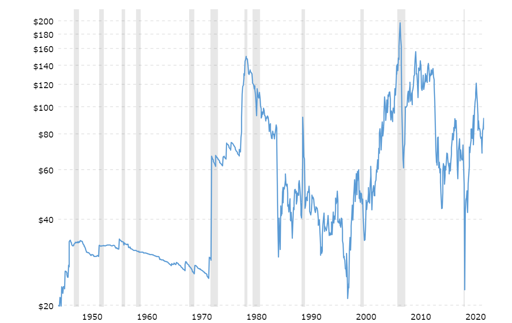
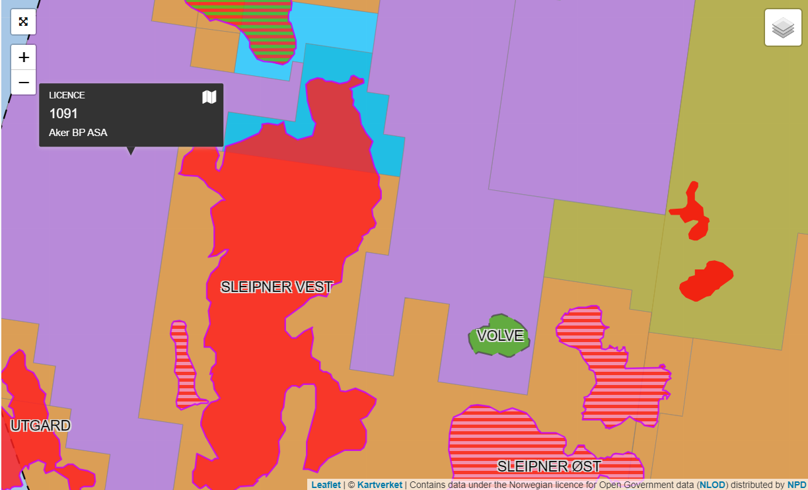
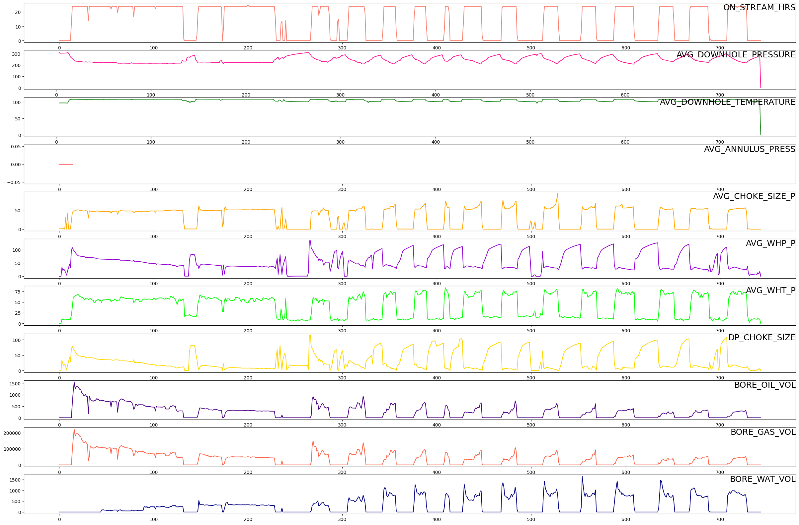
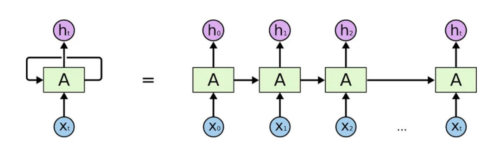
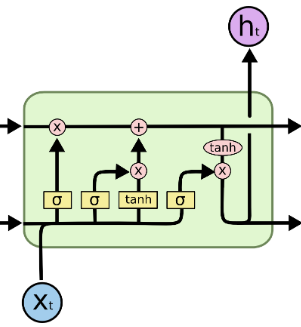
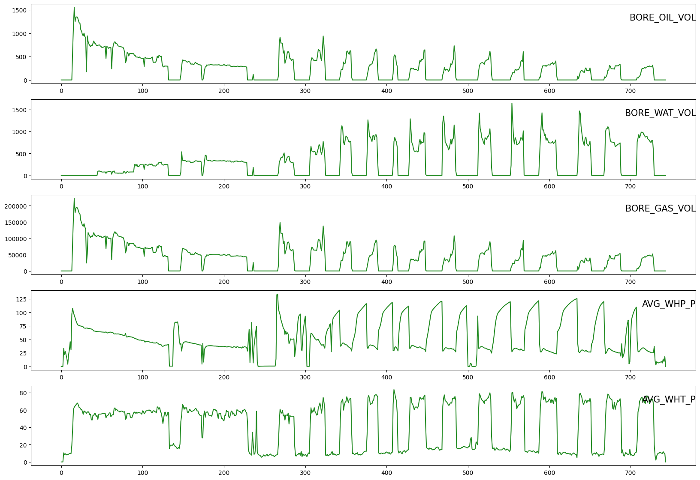
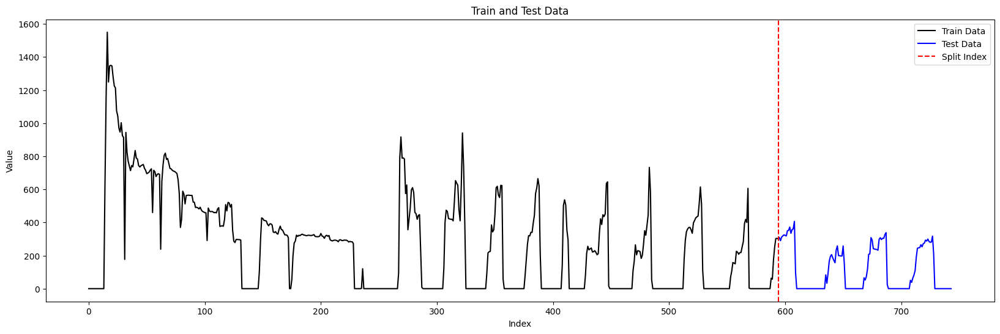
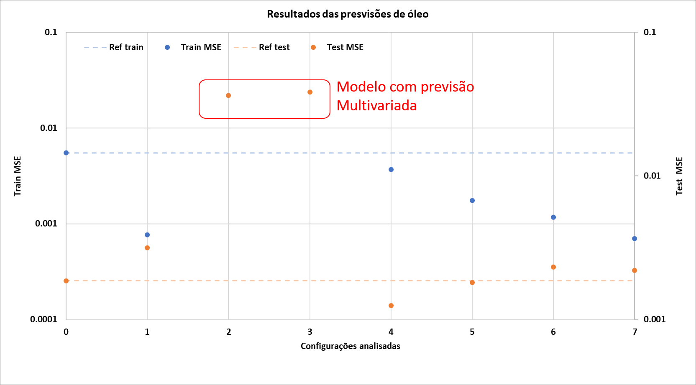

<!-- antes de enviar a versão final, solicitamos que todos os comentários, colocados para orientação ao aluno, sejam removidos do arquivo -->

# Previsão da produção de Óleo com base em modelos de aprendizado profundo

#### Aluno: [Vinicius Mattoso](https://github.com/vinicius-mattoso).
#### Orientadora: [Manoela Kohler](https://github.com/manoelakohler)
<!-- #### Co-orientador(/a/es/as): [Nome Sobrenome](https://github.com/link_do_github). caso não aplicável, remover esta linha -->

---

Trabalho apresentado ao curso [BI MASTER](https://ica.puc-rio.ai/bi-master) como pré-requisito para conclusão de curso e obtenção de crédito na disciplina "Projetos de Sistemas Inteligentes de Apoio à Decisão".

- [Link para o código](https://github.com/link_do_repositorio/nome_do_arquivo_de_codigo). <!-- caso não aplicável, remover esta linha -->

- [Link para a monografia](https://link_da_monografia.com). <!-- caso não aplicável, remover esta linha -->

- Trabalhos relacionados: <!-- caso não aplicável, remover estas linhas -->
    - [Nome do Trabalho 1](https://link_do_trabalho.com).
    - [Nome do Trabalho 2](https://link_do_trabalho.com).

---

### Resumo

<!-- trocar o texto abaixo pelo resumo do trabalho, em português -->

Motivados pela grande relevância energética e financeira do petróleo, muitos estudos buscam desenvolver métodos para estimar a produção de óleo, auxiliando no gerenciamento da produção. Com o advento do desenvolvimento de novas arquiteturas e modelos de inteligências artificias, a quantidade de pesquisas que visam aplicar essa tecnologia para dar suporte à produção de oléo, vem aumentando. Com essa perspectiva, esse trabalho utiliza redes neurais recorrentes para estimar a produção de óleo. Para auxiliar o processo de montagem da arquitetura das redes, utilizou-se o recurso do Optuna. Os resultados presentes nesse trabalho mostram que pode-se estimar a produção de óleo fazendo uso de redes neurais recorrentes.  

### Abstract <!-- Opcional! Caso não aplicável, remover esta seção -->

<!-- trocar o texto abaixo pelo resumo do trabalho, em inglês -->

Motivados pela grande relevância energética e financeira do petróleo, muitos trabalhos buscam desenvolver métodos para fazer estimativas da produção de óleo para auxiliar o gerenciamento da produção. Com o advento de novos desenvolvimento de tipos e arquiteturas de inteligêcnias artificias, a quantidade de trabalho que buscam usar esse tipo de tecnologia para dar suporte a produção de oléo vem aumentando. Com essa perspectiva, esse trabalho utiliza redes neurais recorrentes para estimar a produção de óleo, e para auxiliar o processo de montagem da arquitetura das redes foi utilizado o recursos do Optuna. Os resultados presentes nesse trabalho mostram que pode-se estimar a produção de óleo fazendo uso de redes neurais recorrentes.

### Introdução <!-- Opcional! Caso não aplicável, remover esta seção -->

<!-- trocar o texto abaixo pelo resumo do trabalho, em inglês -->

De acordo com o relatório fornecido em 2016 pela  British Petroleum (BP) [BP, 2016], o petróleo é a fonte de energia primária que possui a maior relevância dentre as outras fontes. A figura abaixo é uma adaptação extraída do relatório mencionado e ilustra a evolução percentual da participação que cada fonte possui ao longo do tempo, começando em 1965 e indo até o ano de 2016, representado pela linha vertical cinza. Além das informações com respeito aos anos anteriores, essa figura também apresenta projeções até o ano de 2035 e, apesar do declinio do percentual, o petróleo ainda irá apresentar grande relevância para o setor energético mundial.

Além do petróleo ocupar uma grande parcela dentre as fontes de energia primária, o mesmo ainda possui o grande valia no aspecto econômico. O gráfico abaixo foi retirado do site https://www.macrotrends.net e contém o histórico do preço do barril de óleo desde 1946 até os dias de hoje.

Pode-se observar no gráfico acima que o valor do barril foi superior à 40 dolares em grande parte da série. O barril atingiu uma máxima histórica, onde o preço do mesmo foi de cerca de 200 dolares nos anos de 2008. 

Diante dos aspectos destacados previamente, pode-se dizer que estudos que auxiliam no processo de gestão e gerenciamento dos reservatórios de petróleo, assim como os que abordam as previsões de demanda e produção, possuem grande relevância para a indústria.

Com o advento de técnicas de inteligência artificial associadas e o aumento da capacidade de cálculo das máquinas, o número de trabalhos e aplicações que são voltadas para essa área da indústria cresceu nos últimos anos. Apresenta-se abaixo, uma listagem de alguns estudos que abordam o uso de inteligência artificial como ferramenta para auxiliar a indústria de oleo e gás.

* Time-series well performance prediction based on Long Short-Term
Memory (LSTM) neural network model (Song e colaboradores,2020);

* Data-driven deep-learning forecasting for oil production and pressure (Werneck e colaboradores, 2022);

* Time series forecasting of petroleum production using deep LSTM
recurrent networks (Sagheer e Kotb, 2019);

* Crude oil price prediction usinf LSTM networks (Gupta e Pandey, 2018).

Seguindo nessa mesma ótica, este trabalho visa utilizar técnicas de aprendizado de máquina afim de estimar a produção de óleo, com base em dados obtidos em campo. Os dados utilizados são séries temporais oriundas de poços produtores de óleo. Devido à informação disponível, o presente trabalho irá utilizar redes neurais recorrentes, que são mais eficazes para essa abordagem.

A organização desse trabalho será feita da seguinte maneira: Apresentação da fonte de dados disponível, seguido da metodologia que será composta pelas informações das redes neurais recorrentes e as técninas de pré-processamento utilizadas. Por fim, serão apresentadas as arquiteturas das redes utilizadas, assim como os resultados e discussões oriundas dos mesmos. 

### Fonte dos dados <!-- Opcional! Caso não aplicável, remover esta seção -->

Os dados utilizados nesse trabalho foram disponibilizados pela empresa Equinor em uma proposta de "Open Science", na qual a empresa disponibilizou dados para pesquisas e desenvolvimento com fins de estudos, inovação e novas soluções energéticas para o futuro. Os dados disponibilizados são aproximadamente 40.000 arquivos oriundos do campo do Volve no mar do Norte. O mapa abaixo ilustra a posição do campo Volvo.

Volve é um campo de petróleo que foi descoberto em 1993 e fica localizado na parte central do Mar do Norte. A camada de água existente é de cerca de 80 metros e a profundidade do reservatório varia entre 2700 a 3100 metros.
Seu plano de operação e desenvolvimento foi aprovado em 2005 e sua produção se iniciou em 2008. Sua produção foi finalizada em 2016 e seus equipamentos foram removidos em 2018.

Na figura a seguir temos as diferentes séries temporais disponíveis. Os dados possuem uma granularidade de dias.

Na sequência será apresentada uma tabela com a relação entre o nome da série temporal exibida acima e a informação à ela associada:  

| Série temporal | Informação |
| -------------- | -----------|
| ON_STREAM_HRS | Tempo de produção em horas |
| AVG_DOWNHOLE_PRESSURE | Média da pressão de fundo de poço |
| AVG_DOWNHOLE_TEMPERATURE | Média da temperatura de fundo de poço |
| AVG_ANNULUS_PRESSURE | Média da pressão do anular |
| AVG_WHP_P | Média da pressão na cabeça do poço |
| AVG_WHT_P | Média da temperatura na cabeça do poço |
| DP_CHOKE_SIZE | Diferencial de pressão oriundo da abertura do choke |
| BORE_OIL_VOL | Volume de óleo produzido |
| BORE_GAS_VOL | Volume de gás produzido |
| BORE_WAT_VOL | Volume de água produzida |

Devido a presença de muitos dados constantes e/ou  faltantes, para utiliza-los, se fazem necessário tratamentos, visando a melhoria da consistência dos mesmos.

### Metodologia <!-- Opcional! Caso não aplicável, remover esta seção -->

Nessa seção será apresentada uma breve explicação das redes neurais recorrentes e, em seguida, serão apresentadas as técnicas de pré-processamento utilizadas nesse trabalho.

#### Redes Neurais Recorrentes (RNNs)

Redes Neurais Recorrentes são um tipo específico de redes neurais que utilizam dados sequênciais ou de séries temporais. Essas redes são recomendadas para trabalhos de previsão numérica de séries temporais, assim como de processamento de linguagem natural. Diferentemente das tradicionais redes convolucionais (CNNs), as RNNs permitem que o processamento dos dados ocorra de maneira sequêncial. A imagem a seguir foi retirada do material do Christopher Olah, 2015, e ilustra uma arquitetura de uma RNNs genérica.

No presente trabalho utilizou-se uma rede neural recorrente específica chamada de Long Short Term Memory (LSTM). As LSTMs foram introduzidas em 1997 por Hochreiter & Schmidhuber e a principal diferença dessa rede é que a mesma possui a capacidade de guardar as informações de celulas anteriores, o estado, por períodos mais longos do que os das tradicionais RNNs. Abaixo temos uma ilustração de uma célula de uma LSTM tembém retirada do trabalho do Christopher Olah, 2015.

#### Pré-processamento

Falar que só será utilizado os dados de produção.

Para uma parte do trabalho de multivariáveis iremos utilizar o seguinte conjunto de séries temporais:

Janelamento dos dados

preparação da base de dados

Vamos separar a base de dados em 80% para treinamento e 20% para dados de teste.

#### Resultados

##### Arquitetura do modelo

##### Otimização dos hyperparâmetros (Optuna)

#### Referências

I - [OUTLOOK, BP Energy. 2035. 2015. URL: http://www. bp. com, 2016](https://www.bp.com/content/dam/bp/business-sites/en/global/corporate/pdfs/energy-economics/energy-outlook/bp-energy-outlook-2016.pdf)

II - [Hopfield,J J.  Neural networks and physical systems with emergent collective computational abilities. 1982. URL: https://www.pnas.org/doi/10.1073/pnas.79.8.2554](https://www.pnas.org/doi/10.1073/pnas.79.8.2554)

III - [OLAH, Christopher. Understanding lstm networks. 2015. URL:https://colah.github.io/posts/2015-08-Understanding-LSTMs/](https://colah.github.io/posts/2015-08-Understanding-LSTMs/)
---

Matrícula: 123.456.789

Pontifícia Universidade Católica do Rio de Janeiro

Curso de Pós Graduação *Business Intelligence Master*
