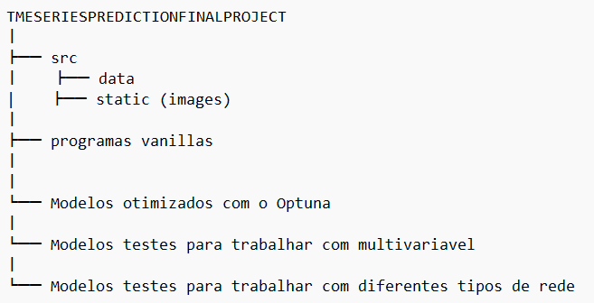
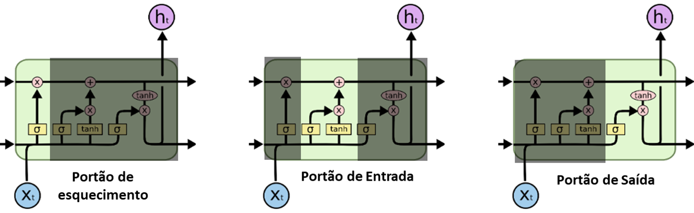
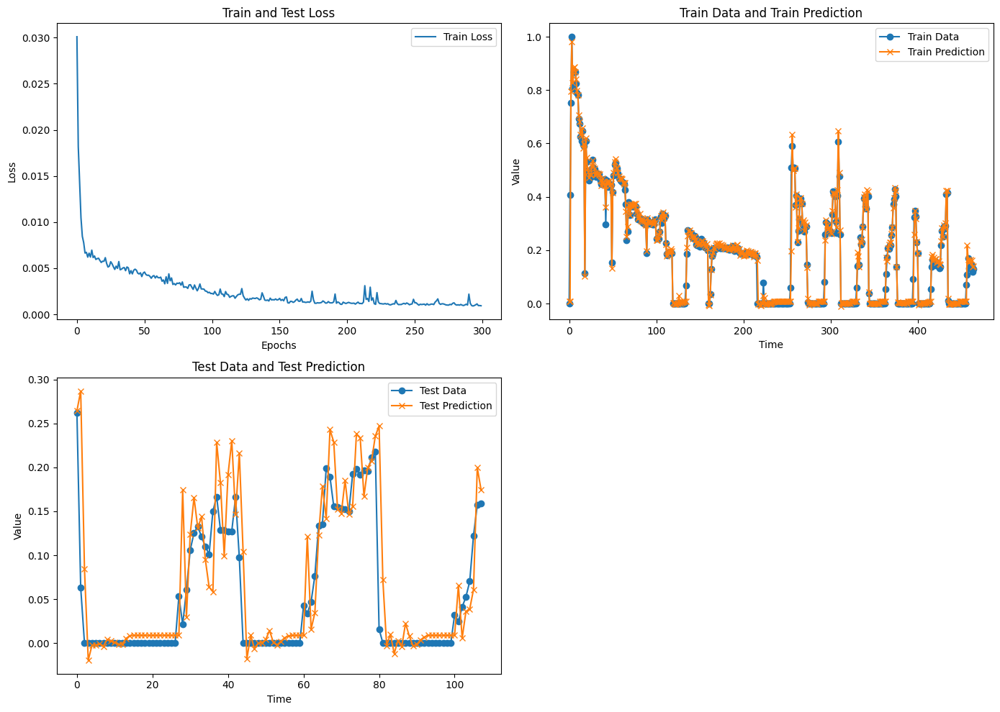
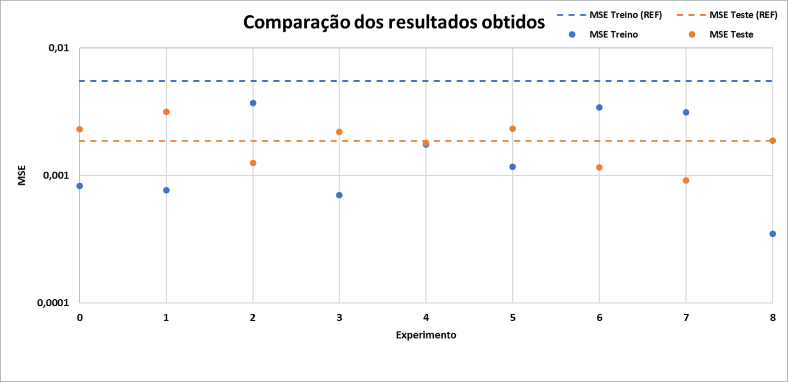
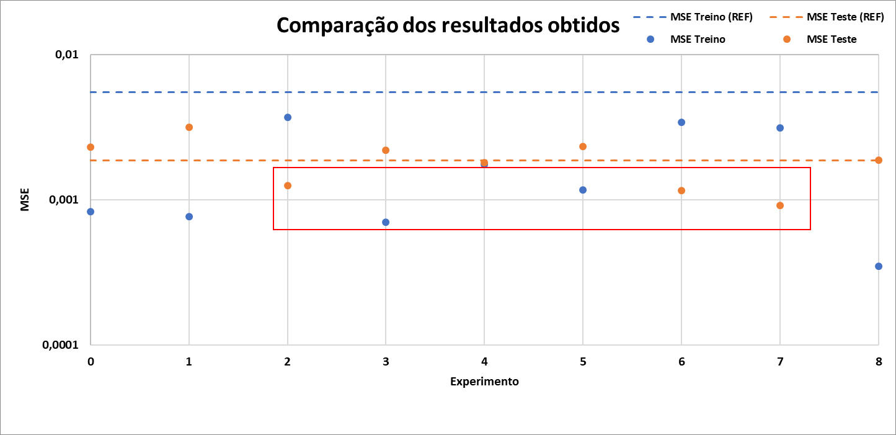
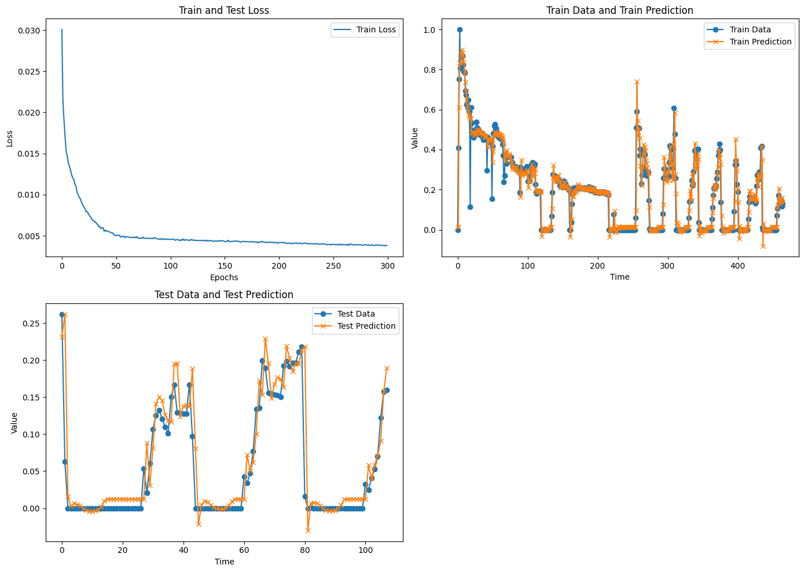
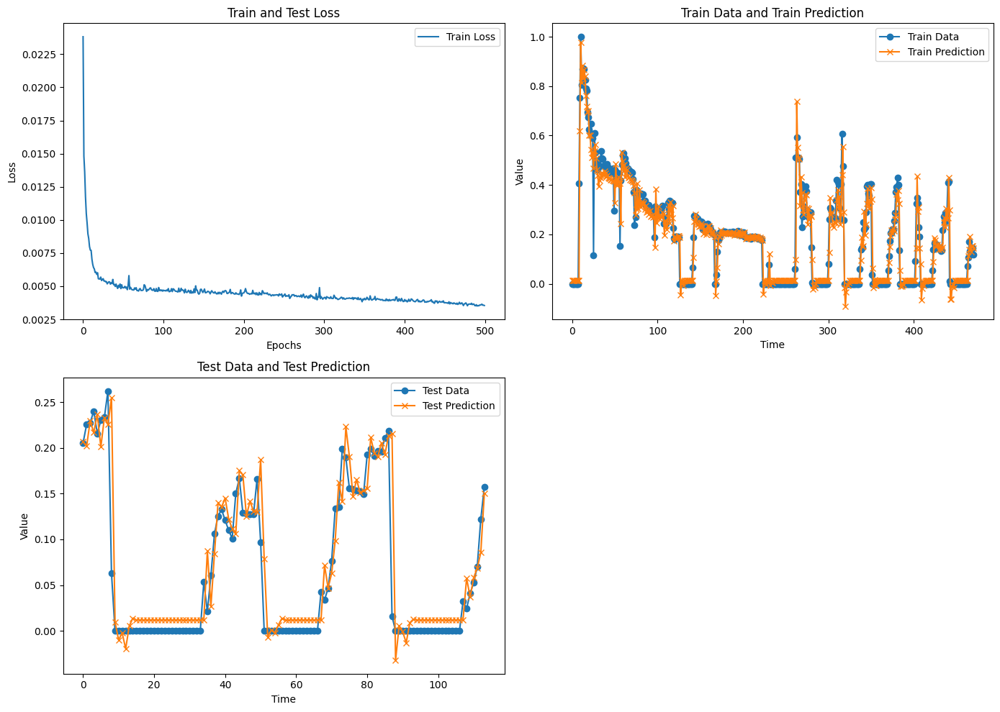
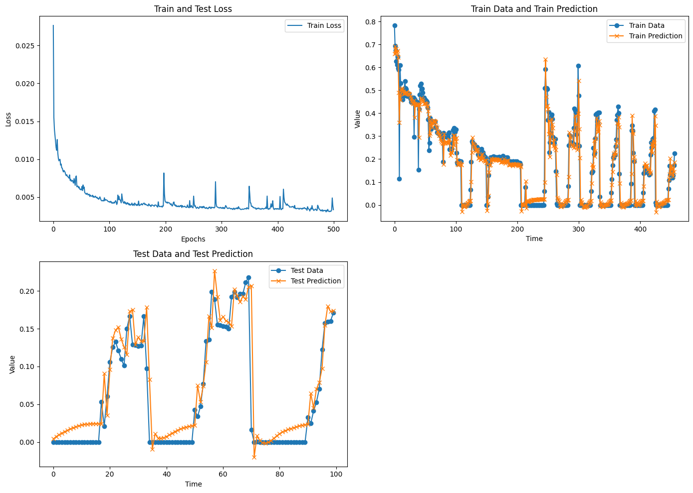

<!-- antes de enviar a versão final, solicitamos que todos os comentários, colocados para orientação ao aluno, sejam removidos do arquivo -->

# Previsão da produção de Óleo com base em modelos de aprendizado profundo

#### Aluno: [Vinicius Mattoso](https://github.com/vinicius-mattoso).
#### Orientadora: [Manoela Kohler](https://github.com/manoelakohler)
<!-- #### Co-orientador(/a/es/as): [Nome Sobrenome](https://github.com/link_do_github). caso não aplicável, remover esta linha -->

---

Trabalho apresentado ao curso [BI MASTER](https://ica.puc-rio.ai/bi-master) como pré-requisito para conclusão de curso e obtenção de crédito na disciplina "Projetos de Sistemas Inteligentes de Apoio à Decisão".

- [Link para o código](https://github.com/vinicius-mattoso/TimeSeriesPredictionFinalProject). <!-- caso não aplicável, remover esta linha -->

- [Link para a monografia](https://github.com/vinicius-mattoso/TimeSeriesPredictionFinalProject). <!-- caso não aplicável, remover esta linha -->

Estrutura dos arquivos:

    

---

### Resumo

<!-- trocar o texto abaixo pelo resumo do trabalho, em português -->

Motivado pela relevância econômica e energética do petróleo, este estudo visa estimar a produção de óleo, oferecendo suporte ao gerenciamento estratégico na indústria petrolífera. Utilizando redes neurais recorrentes, este trabalho explora as possibilidades desses modelos para previsão e captura de padrões temporais complexos nos dados de produção. Destaca-se a utilização do Optuna, recurso empregado para otimizar a montagem das arquiteturas das redes neurais. Os resultados demonstram a viabilidade das redes neurais recorrentes na estimativa da produção de óleo, indicando uma promissora ferramenta para embasar decisões no setor petrolífero.  

### Abstract <!-- Opcional! Caso não aplicável, remover esta seção -->

<!-- trocar o texto abaixo pelo resumo do trabalho, em inglês -->

Motivated by the economic and energy relevance of oil, this study aims to estimate oil production, providing support for strategic management in the oil industry. Using recurrent neural networks, this work explores the capabilities of these models for predicting and capturing complex temporal patterns in production data. Notably, the use of Optuna is highlighted, a resource employed to optimize the assembly of neural network architectures. The results demonstrate the viability of recurrent neural networks in estimating oil production, indicating a promising tool to support decision-making in the oil sector.

### Introdução <!-- Opcional! Caso não aplicável, remover esta seção -->

<!-- trocar o texto abaixo pelo resumo do trabalho, em inglês -->

De acordo com o relatório fornecido em 2016 pela  British Petroleum (BP) [BP, 2016], o petróleo é a fonte de energia primária que possui a maior relevância dentre as outras fontes. A figura abaixo é uma adaptação extraída do relatório mencionado e ilustra a evolução percentual da participação que cada fonte possui ao longo do tempo, começando em 1965 e indo até o ano de 2016, representado pela linha vertical cinza. Além das informações com respeito aos anos anteriores, essa figura também apresenta projeções até o ano de 2035 e, apesar do declinio do percentual, o petróleo ainda irá apresentar grande relevância para o setor energético mundial.

Além do petróleo ocupar uma grande parcela dentre as fontes de energia primária, o mesmo ainda possui o grande valia no aspecto econômico. O gráfico abaixo foi retirado do site https://www.macrotrends.net e contém o histórico do preço do barril de óleo desde 1946 até os dias de hoje.

Pode-se observar no gráfico acima que o valor do barril foi superior à 40 dolares em grande parte da série. O barril atingiu uma máxima histórica, onde o preço do mesmo foi de cerca de 200 dolares nos anos de 2008. 

Diante dos aspectos destacados previamente, pode-se dizer que estudos que auxiliam no processo de gestão e gerenciamento dos reservatórios de petróleo, assim como os que abordam as previsões de demanda e produção, possuem grande relevância para a indústria.

Com o advento de técnicas de inteligência artificial associadas e o aumento da capacidade de cálculo das máquinas, o número de trabalhos e aplicações que são voltadas para essa área da indústria cresceu nos últimos anos. Apresenta-se abaixo, uma listagem de alguns estudos que abordam o uso de inteligência artificial como ferramenta para auxiliar a indústria de oleo e gás.

* Data-driven deep-learning forecasting for oil production and pressure (Werneck e colaboradores, 2022);

* Time-series well performance prediction based on Long Short-Term
Memory (LSTM) neural network model (Song e colaboradores,2020);

* Time series forecasting of petroleum production using deep LSTM
recurrent networks (Sagheer e Kotb, 2019);

* Crude oil price prediction usinf LSTM networks (Gupta e Pandey, 2018).

Seguindo nessa mesma ótica, este trabalho visa utilizar técnicas de aprendizado de máquina afim de estimar a produção de óleo, com base em dados obtidos em campo. Os dados utilizados são séries temporais oriundas de poços produtores de óleo. Devido à informação disponível, o presente trabalho irá utilizar redes neurais recorrentes, que são mais eficazes para essa abordagem.

A organização desse trabalho será feita da seguinte maneira: Apresentação da fonte de dados disponível, seguido da metodologia que será composta pelas informações das redes neurais recorrentes e as técninas de pré-processamento utilizadas. Por fim, serão apresentadas as arquiteturas das redes utilizadas, assim como os resultados e discussões oriundas dos mesmos. 

### Fonte dos dados <!-- Opcional! Caso não aplicável, remover esta seção -->

Os dados utilizados nesse trabalho foram disponibilizados pela empresa Equinor em uma proposta de "Open Science", na qual a empresa disponibilizou dados para pesquisas e desenvolvimento com fins de estudos, inovação e novas soluções energéticas para o futuro. Os dados disponibilizados são aproximadamente 40.000 arquivos oriundos do campo do Volve no mar do Norte. O mapa abaixo ilustra a posição do campo Volvo.

Volve é um campo de petróleo que foi descoberto em 1993 e fica localizado na parte central do Mar do Norte. A camada de água existente é de cerca de 80 metros e a profundidade do reservatório varia entre 2700 a 3100 metros.
Seu plano de operação e desenvolvimento foi aprovado em 2005 e sua produção se iniciou em 2008. Sua produção foi finalizada em 2016 e seus equipamentos foram removidos em 2018.

Na figura a seguir temos as diferentes séries temporais disponíveis. Os dados possuem uma granularidade de dias.

Na sequência será apresentada uma tabela com a relação entre o nome da série temporal exibida acima e a informação à ela associada:  

| Série temporal | Informação |
| -------------- | -----------|
| ON_STREAM_HRS | Tempo de produção em horas |
| AVG_DOWNHOLE_PRESSURE | Média da pressão de fundo de poço |
| AVG_DOWNHOLE_TEMPERATURE | Média da temperatura de fundo de poço |
| AVG_ANNULUS_PRESSURE | Média da pressão do anular |
| AVG_WHP_P | Média da pressão na cabeça do poço |
| AVG_WHT_P | Média da temperatura na cabeça do poço |
| DP_CHOKE_SIZE | Diferencial de pressão oriundo da abertura do choke |
| BORE_OIL_VOL | Volume de óleo produzido |
| BORE_GAS_VOL | Volume de gás produzido |
| BORE_WAT_VOL | Volume de água produzida |

Devido a presença de muitos dados constantes e/ou  faltantes, para utiliza-los, se fazem necessário tratamentos, visando a melhoria da consistência dos mesmos.

### Metodologia <!-- Opcional! Caso não aplicável, remover esta seção -->

Nessa seção será apresentada uma breve explicação das redes neurais recorrentes e, em seguida, serão apresentadas as técnicas de pré-processamento utilizadas nesse trabalho.

#### Redes Neurais Recorrentes (RNNs)

Redes Neurais Recorrentes são um tipo específico de redes neurais que utilizam dados sequênciais ou de séries temporais. Essas redes são recomendadas para trabalhos de previsão numérica de séries temporais, assim como de processamento de linguagem natural. Diferentemente das tradicionais redes convolucionais (CNNs), as RNNs permitem que o processamento dos dados ocorra de maneira sequêncial. A imagem a seguir foi retirada do material do Christopher Olah, 2015, e ilustra uma arquitetura de uma RNNs genérica.

No presente trabalho utilizou-se uma rede neural recorrente específica chamada de Long Short Term Memory (LSTM). As LSTMs foram introduzidas em 1997 por Hochreiter & Schmidhuber e a principal diferença dessa rede é que a mesma possui a capacidade de guardar as informações de celulas anteriores, o estado, por períodos mais longos do que os das tradicionais RNNs. Abaixo temos uma ilustração de uma célula de uma LSTM tembém retirada do trabalho do Christopher Olah, 2015.

Os portões (gates) representam uma parte fundamental na estrutura de uma LSTM. Esses mecanismos de controle, compostos pelos portões de entrada, esquecimento e saída, têm a função de regular o fluxo de informações ao longo da sequência temporal. O 'portão de entrada' decide quais informações são atualizadas na célula de memória, o 'portão de esquecimento' controla o quanto das informações anteriores deve ser mantido ou descartado, e o 'portão de saída' determina qual parte da informação atualizada na célula de memória será usada para a previsão. Esses mecanismos permitem que a LSTM aprenda e retenha relações temporais complexas nos dados, auxiliando na redução do problema de desvanecimento do gradiente e possibilitando a captura de dependências de longo prazo, tornando-a especialmente eficaz em tarefas de previsão e modelagem de sequências.

#### Pré-processamento

Uma das técnicas de pré-processamento possíveis quando há valores ausentes no conjunto de dados é a exclusão das linhas correspondentes. No entanto, ao analisar as informações do AVG_ANNULUS_PRESSURE, percebe-se que a exclusão resultaria na remoção quase total do dataset. Para evitar essa perda substancial de dados, optou-se por uma abordagem de segmentação, restringindo os dados a séries temporais específicas:

Após a segmentação das séries temporais a serem utilizadas neste estudo, foi aplicada a técnicas de remoção de dados para lidar com valores ausentes, caso houvesse alguma lacuna entre as variáveis no mesmo instante de tempo. Uma segunda abordagem envolveu a preparação do conjunto de dados por meio da formação de janelas.

A formação de janelas de dados é uma técnica na qual os dados de entrada para a rede neural e os valores-alvo para previsão são separados. A figura abaixo ilustra esse processo: 

A janela de entrada compreende três pontos temporais anteriores utilizados como dados de entrada para a rede neural, enquanto o valor-alvo é representado em vermelho. Com base nesse valor-alvo, é possível realizar análises métricas para avaliar a eficácia da rede. O esquema a seguir ilustra como o conjunto de dados é organizado após o processo de janelamento. Observa-se que os valores previstos não são usados como entrada para a previsão de passos futuros; em vez disso, a previsão é feita considerando apenas um ponto no futuro.

A utilização do MinMaxScaler, como a terceira técnica de pré-processamento, desempenha um papel fundamental na normalização dos dados, seguindo a segmentação das séries temporais e a aplicação de janelamento. O MinMaxScaler permite a transformação dos valores do conjunto de dados para um intervalo predefinido, comumente entre 0 e 1, preservando a distribuição dos dados e minimizando diferenças de escala entre as variáveis. Esta técnica é vital para garantir uma uniformidade na escala das variáveis, favorecendo algoritmos sensíveis à variação de escala. Abaixo é apresentada a equação de normalização empregada.

Por fim, além do MinMaxScaler, a etapa subsequente envolve a segregação dos dados em conjuntos de treino e teste. Essa divisão é essencial para avaliar o desempenho do modelo, treinando-o com 80% dos dados e reservando os últimos 20% para testar a capacidade de generalização do modelo para novos dados não vistos durante o treinamento, mantendo a ordem temporal.

A figura acima ilustra o processo de segregação dos dados em conjuntos de treino e teste, utilizando o MinMaxScaler para normalização e seguindo a ordem temporal. Nessa representação, os dados empregados no conjunto de teste estão destacados em azul, enquanto os dados de treino são marcados em preto. O ponto de corte entre os dados de treino e teste é claramente indicado por uma linha tracejada vermelha. Essa demarcação temporal é essencial para preservar a sequência cronológica dos dados e garantir que o modelo seja avaliado em dados não vistos e futuros.

#### Resultados

Nesta seção, apresentamos os resultados obtidos por meio da aplicação de diferentes arquiteturas de redes neurais recorrentes do tipo LSTM para a previsão da produção de óleo. Inicialmente, a primeira tentativa de previsão foi realizada exclusivamente utilizando a série temporal com informações da produção de óleo. À medida que este estudo progrediu, foram conduzidos testes adicionais explorando a previsão com o uso de múltiplas variáveis, embora, até o momento, estes testes estejam em fase inicial. Este trabalho destaca os resultados, tanto das tentativas iniciais que consideraram apenas a série temporal univariada quanto das investigações mais recentes que envolveram a inclusão de múltiplas variáveis para aprimorar as previsões da produção de óleo.

##### Arquitetura da Rede Neural

A arquitetura e a escolha dos hiperparâmetros são fundamentais para o desempenho eficaz de uma rede LSTM. A configuração adequada, incluindo o número de camadas LSTM, o tamanho das células de memória, a taxa de aprendizado e outros hiperparâmetros, impacta diretamente a capacidade da rede em aprender e capturar relações temporais complexas nos dados. A seleção criteriosa desses parâmetros e a arquitetura apropriada são essenciais para otimizar a capacidade da LSTM em modelar padrões temporais, garantindo uma generalização eficaz para dados futuros e, consequentemente, aprimorando a qualidade das previsões. Portanto, compreender e otimizar esses elementos são cruciais para alcançar um desempenho eficaz e preciso na previsão com redes LSTM.

Neste trabalho, o framework [Optuna](https://optuna.org/) foi utilizado para otimizar os hiperparâmetros da rede. Para comparação, foi criado um modelo 'vanilla', um modelo simples que contém diferentes tipos de camadas que podem estar presentes em uma LSTM. Em seguida, o Optuna foi empregado gradualmente para liberar os hiperparâmetros, fornecendo uma compreensão mais aprofundada das otimizações realizadas.

A figura abaixo apresenta o resultado da rede considerada 'vanilla', seguido pela arquitetura dessa rede:

Código com a arquitetura da rede:

<pre>
model_LSTM = Sequential()
model_LSTM.reset_states()
model_LSTM.add(LSTM(n_neurons, input_shape=(time_steps, input_dim), return_sequences=True))
model_LSTM.add(LSTM(n_neurons, return_sequences=True))
model_LSTM.add(Dropout(0.2))
model_LSTM.add(LSTM(n_neurons, return_sequences=True))
model_LSTM.add(LSTM(n_neurons, return_sequences=False))
model_LSTM.add(Dense(output_dim))
model_LSTM.compile(loss='mean_squared_error', optimizer='adam', metrics=['mean_absolute_error'])
</pre>

Neste resultado, observamos que ao aplicar a rede aos dados de testes, as previsões exibiram uma série de oscilações acentuadas, caracterizadas por picos intermitentes. Esses picos representam valores atípicos. Além disso, é importante ressaltar que, apesar da boa performance da rede nos dados de teste, é crucial avaliar o risco de overfitting. A aparente precisão das previsões nos dados de teste pode indicar um ajuste excessivo da rede aos dados de treino, o que pode resultar em uma capacidade reduzida de generalização para novos conjuntos de dados. A próxima seção apresentará os resultados das otimizações realizadas, buscando melhorar a capacidade de generalização da rede e reduzir possíveis problemas de overfitting.

##### Otimização dos hyperparâmetros (Optuna)

A tabela a seguir apresenta os parâmetros utilizados em cada um dos experimentos realizados, bem como o valor do erro quadrático médio (MSE) para o conjunto de treino e de teste. O experimento 0 refere-se ao modelo 'vanilla' mencionado anteriormente. Por outro lado, o experimento 1 segue a mesma arquitetura, porém com um maior número de épocas de treinamento, com o intuito de investigar o impacto dessa variável na performance da rede.

Para facilitar o processo de análise de cada modelo, foi criado o gráfico abaixo. Neste gráfico, os pontos azuis representam o erro quadrático médio dos dados de treino, enquanto os pontos alaranjados representam os resultados para os dados de teste. As linhas tracejadas foram geradas assumindo que a previsão do ponto futuro é sempre o valor do último ponto do conjunto de dados. Resultados mais interessantes são aqueles que exibem um erro menor quando aplicados aos dados de teste em comparação com o valor tracejado. Além disso, bons modelos não necessariamente apresentam erros significativamente menores quando aplicados aos dados de treino, pois um erro muito baixo pode indicar overtraining. 

Com base nisso, destacam-se os seguintes modelos:

Os experimentos 2, 6 e 7 são exemplos de análises que demonstram baixo erro nos dados de teste, juntamente com erros similares nos dados de treino. A seguir, serão apresentados os resultados gráficos de cada um desses experimentos.

##### Experimento 2
Arquitetura da rede:

| Experimento | Tamanho do Janelamento | Num Neurônios | Num Camadas | Épocas de Treinamento | Taxa de Aprendizado | Possui Dropout | Taxa do Dropout | Utilizou OPTUNA | Tamanho do Batch |
|-------------|------------------------|---------------|-------------|-----------------------|---------------------|----------------|-----------------|-----------------|------------------|
| 2 | 14 | 50 | 2 | 300 | 0.0001 | Não | 0.0 | Sim | 1 |

##### Experimento 6

Arquitetura da rede:

| Experimento | Tamanho do Janelamento | Num Neurônios | Num Camadas | Épocas de Treinamento | Taxa de Aprendizado | Possui Dropout | Taxa do Dropout | Utilizou OPTUNA | Tamanho do Batch |
|-------------|------------------------|---------------|-------------|-----------------------|---------------------|----------------|-----------------|-----------------|------------------|
| 6 | 7 | 249 | 2 | 500 | 0.00025038 | Não | 0.0 | Sim | 7 |

##### Experimento 7

Arquitetura da rede:

| Experimento | Tamanho do Janelamento | Num Neurônios | Num Camadas | Épocas de Treinamento | Taxa de Aprendizado | Possui Dropout | Taxa do Dropout | Utilizou OPTUNA | Tamanho do Batch |
|-------------|------------------------|---------------|-------------|-----------------------|---------------------|----------------|-----------------|-----------------|------------------|
| 7 | 24 | 250 | 2 | 500 | 0.00015406 | Sim | 0.11099 | Sim | 24 |

#### Referências

I - [OUTLOOK, BP Energy. 2035. 2015.](https://www.bp.com/content/dam/bp/business-sites/en/global/corporate/pdfs/energy-economics/energy-outlook/bp-energy-outlook-2016.pdf)

II - [Hopfield,J J.  Neural networks and physical systems with emergent collective computational abilities. 1982. URL: https://www.pnas.org/doi/10.1073/pnas.79.8.2554](https://www.pnas.org/doi/10.1073/pnas.79.8.2554)

III - [OLAH, Christopher. Understanding lstm networks. 2015. ](https://colah.github.io/posts/2015-08-Understanding-LSTMs/)

IV - [Takuya Akiba, Shotaro Sano, Toshihiko Yanase, Takeru Ohta, and Masanori Koyama. 2019. Optuna: A Next-generation Hyperparameter Optimization Framework. In KDD.](https://optuna.org/)

---

Matrícula: 212.100.348

Pontifícia Universidade Católica do Rio de Janeiro

Curso de Pós Graduação *Business Intelligence Master*
